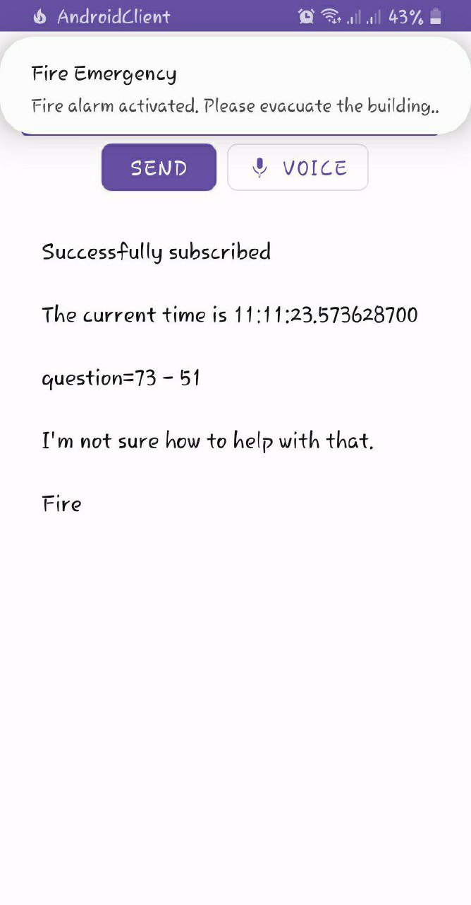

## Multiplatform Project with Embedded Devices

This project is a multiplatform system with three main components:

**1. Websocket Server (Core):**

* Handles requests from the other two platforms (Android client and embedded devices).
* Has a web HTML client interface for user interaction.
* A simple command processing like responding to the questions like "what is the date and time", "greetings", "
  weather", "generating new mathematics question"

**2. Android Client:**

* Functions similarly to the web HTML client, interacting with the server.
* \+ speech to text api
  
  

**3. Embedded Devices (Focus):**

* This section utilizes various microcontroller boards and components.

**Components in Embedded Devices:**

1. ESP32 S3 Microcontroller Board
2. Keypad (4x4 matrix)
3. 4-Digit, 7-Segment Display
4. DY MP3 Module (for audio playback)
5. 5V Speaker
6. Passive Buzzer
7. Liquid Crystal Display (LCD)
8. IR Fire Sensor
9. (Optional) Arduino Nano (if using for prototyping)

**Functionality of ESP32 S3 System:**

1. **WiFi Connection and Websocket Subscription:**
    * The ESP32 S3 connects to a WiFi network.
    * It then subscribes to a specific channel on the websocket server.

2. **User Login:**
    * The user presses the "D" button on the keypad.
    * They then enter a login password on the keypad.
    * The ESP32 S3 displays the entered numbers on the 7-segment display.
    * The entered password is sent to the server for verification.
    * Upon successful login, the server sends a confirmation message.

3. **Countdown Timer:**

    * The user presses the "A" button to initiate a countdown timer.
    * The ESP32 S3 awaits user input for the countdown duration.
    * As the user presses number buttons, the entered value is displayed on the 7-segment display.
    * Pressing "#" confirms the entered duration, and the countdown begins.

4. **Math Question and Answer:**

    * The user presses the "C" button to receive a math question.
    * The server broadcasts a math question through the subscribed channel.
    * The ESP32 S3 enters a state waiting for user input on the keypad for the answer.
    * The user enters their answer, displayed on the 7-segment display.
    * Pressing "#" sends the answer to the server for evaluation.
    * Based on the server's response (correct/incorrect), a message is displayed on the 7-segment display.

5. **Cancelling ongoing operations:**
    * The user presses the "B" button to cancel the operations described before

**Functionalities of Other Components (Brief Descriptions):**

* **ESP8266 with DY Audio Module, Speaker, and Buzzer:**
    * Similar Wi-Fi and server connection process as ESP32 S3.
    * Uses the buzzer for notifications.
    * Uses the speaker and DY module to play audio responses based on user actions.
    * Communicates with the Arduino Nano using RX/TX pins.

* **Arduino Nano with LCD and IR Fire Sensor:**
    * Receives messages from the ESP8266 through RX/TX pins.
    * Displays messages (like math questions) on the LCD.
    * Detects fire with the IR sensor.
    * Upon fire detection, sends a signal to the ESP8266.
    * The ESP8266 relays the fire alert signal to the server for broadcasting to connected devices.

### Devices pinout 

* esp32 s3

* esp8266 12e

* arduino nano

